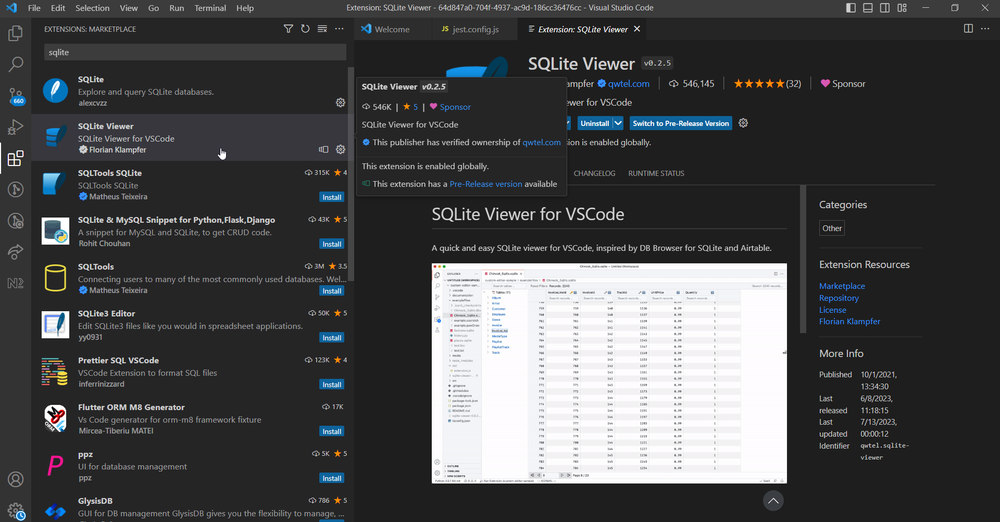

# Welcome to `Hacktitude Malaysia 2023`

Welcome to the final run of Hacktitude Malaysia 2023! Before you begin, please ensure that your machine is set up correctly by following these instructions.

## Setting pre-requisites in your environment

This section helps you understand the prerequisites required to complete the hackathon.

> _Recommended: To ensure seamless management of multiple Node.js versions on your machine, it is highly recommended to use a **Node Version Manager (NVM)**._
> 

> &ensp; &ensp;  For Windows -: <a href="https://github.com/coreybutler/nvm-windows/releases/download/1.1.11/nvm-setup.exe" target="_blank">Downlad .exe file</a>
>   
> &ensp; &ensp;  Mac and Linux -: <a href="https://github.com/nvm-sh/nvm/blob/master/README.md#installing-and-updating" target="_blank">Refer this</a>

 
   
**Installations required:** 
   &ensp; &ensp; &ensp; &ensp;**- <a href="https://git-scm.com/downloads" target="_blank">Git</a>** 
   &ensp; &ensp; &ensp; &ensp;**- <a href="https://nodejs.org/ja/blog/release/v14.15.0" target="_blank">Node.js version 14.15.0</a>** 
   &ensp; &ensp; &ensp; &ensp;**- <a href="https://www.npmjs.com/" target="_blank">npm</a>** 
   &ensp; &ensp; &ensp; &ensp;**- Install <a href="https://www.geeksforgeeks.org/how-to-enable-live-server-on-visual-studio-code/" target="_blank">Live Server</a> on Visual Studio Code** 

## Remove code commit credentials

Remove code commit credentials if there are any previous credentials stored in your computer.

### In Windows

* Open **Control Panel > User Accounts > Credential Manager > Windows Credentials**
* Remove any stored credentials for CodeCommit.

 

  

### In Mac

* Go to **KeyChain Access**
* Remove any stored credentials for CodeCommit.

 

  

## Legitimacy of your solution

Any attempt to compromise the integrity of the contest will `unconditionally disqualify` your team. Therefore, please ensure you avoid attempting:

- Tampering with files in the `tests` folder or `config` folder.
- Hard coding values or logic to pass the test without solving the challenge legitimately.

## Improving your developer experience (Optional)

This step is not mandatory for working on the Hacktitude challenges, but it may improve your development experience. You can consider the following:

- Install a plugin for **SQLite Viewer** on your IDE so that you can explore the SQLite database.
  

  
  

- Install any other plugin that you find necessary to improve your developer experience.

## Video Guide for Hacktitude

<iframe src="https://www.youtube.com/embed/g64E2xITyLE" title="YouTube video player" frameborder="0" allow="accelerometer; autoplay; clipboard-write; encrypted-media; gyroscope; picture-in-picture; web-share" allowfullscreen></iframe>

##  Important !! 

* _Ensure that you go through all the instructions before the competition and read the challenge descriptions thoroughly._

* _Using ChatGPT or any AI-related tools will be identified on the DevGrade platform and will result in immediate disqualification from the hackathon._

* _The  final competition is scheduled for a duration of **9 hours** starting at 3.00 PM MYT._

* _Violation of the rules and regulations, or any attempt to gain an unfair advantage may result in disqualification._

* _Refrain from refreshing the DevGrade User Guide page._

## Getting support

On the day of the competition, limited support will be available. However, for assistance with project setup, you may contact our technical support team via WhatsApp at the following phone number: `+94 74 354 6446`. Please be aware that technical doubts will not be addressed through this channel. In relation to any questions concerning the competition, we may share your inquiry, along with our response, anonymously with all team leaders in the WhatsApp chat group.

For non-technical support needs, you can reach out to our Malaysian Representative, Anne Gomez, via the number: `+60 18 299 4076`. Please kindly use calls only for this purpose.

We appreciate your understanding and cooperation, and we're looking forward to a successful and enjoyable contest. Thank you.

## References

- <a href="https://www.hacktitude.io" target="_blank">Hacktitude official website</a>
- <a href="https://www.hacktitude.io/faq" target="_blank">Hacktitude FAQ</a>
- <a href="https://99x.io" target="_blank">99x website</a>
- <a href="https://devgrade.io/" target="_blank">DevGrade website</a>
